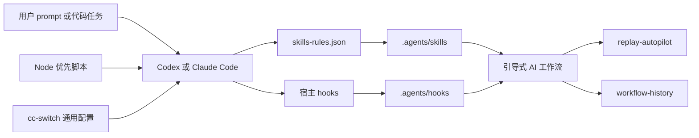

**简体中文** | [English](./README.en.md)

# AI Workflow Control Kit

一套可迁移的 AI 辅助软件交付控制平面：技能（skills）、钩子（hooks）、宿主适配器和回放自动化。

AI Workflow Control Kit 把一套 AI 辅助研发工作流背后可复用的基础设施打包起来。它的目标是让 AI 编码更少依赖临时对话，更多依赖明确的门禁、可执行的证据、评审闭环，以及基于回放（replay）的评估。

## 它提供什么

- 自定义技能和技能路由规则。
- 用于技能激活、执行回执和工作流状态同步的 hooks。
- Claude Code 和 Codex 宿主适配器。
- cc-switch 通用配置模板。
- 用于 token 感知 shell 使用的 RTK 集成指引。
- replay-autopilot：用于隔离回放、工作流保真校验、可执行证据门禁、覆盖率核算、失败审计和 stop-and-evolve 控制循环。
- 安装、校验和密钥扫描脚本。

## 它不包含什么

本仓库有意不包含运行态或私密状态：

- 认证 token 或 provider API key
- Codex 或 Claude 运行态会话
- SQLite 状态、缓存、日志、history 或本地记忆
- 业务项目源代码
- 私密 oracle diff 或生产数据
- 机器相关的 `.env` 文件

## 架构



关于目录模型、技能路由、hook 生命周期、cc-switch 集成以及无人值守回放控制平面的详细说明，请参阅 [docs/ARCHITECTURE.md](docs/ARCHITECTURE.md)。

```text
agents/              规范的技能、hooks、规则和模板
claude/              Claude Code 适配器和示例配置
codex/               Codex 适配器、RTK、hooks 和示例配置
cc-switch/           可迁移的通用配置模板
replay-autopilot/    回放控制平面、证据门禁、覆盖率核算和无人值守演进
workflow-history/    仓库本地的工作流变更索引和记录
scripts/             安装、校验和远程引导脚本
docs/                迁移、产品化和运维指南
```

## 前置条件

任何新机器上需要：

- Git
- Node.js >= 18
- Codex 或 Claude Code

使用相关集成时推荐：

- Python（用于写入 cc-switch 的 SQLite 设置）
- PowerShell 7（`pwsh`），用于遗留回放脚本和一次性的 Windows 维护
- cc-switch，用于共享 Claude/Codex 通用配置
- rtk，用于 Claude 的 `PreToolUse` hook 路径
- uv、bun、ffmpeg 和 openspec，用于会调用这些工具的技能

## 快速开始

克隆仓库：

```powershell
git clone https://github.com/hxld/ai-workflow-control-kit.git
cd ai-workflow-control-kit
```

先跑一次 dry run：

```bash
node scripts/install-ai-workflow-kit.js --dry-run --backup-existing
```

带备份安装：

```bash
node scripts/install-ai-workflow-kit.js --backup-existing
```

校验安装：

```bash
node scripts/verify-ai-workflow-kit.js
node scripts/verify-control-contracts.js
```

## 自定义路径和团队扩展

所有安装路径都可以通过命令行参数自定义（按 Enter 接受默认值）：

```bash
node scripts/install-ai-workflow-kit.js \
  --agents-home ~/.agents \
  --codex-home ~/.codex \
  --claude-home ~/.claude \
  --replay-autopilot-root ~/.ai-workflow-control-kit/replay-autopilot \
  --backup-existing
```

首次安装推荐用交互向导：

```bash
node scripts/install-ai-workflow-kit.js --interactive
```

**公司特定技能**：如果团队有公司内部流程（如 Git/MR 规范、工时评估），可以在 `agents/skills/` 下加一个 `skill-rules.company.json` 文件（见 `skill-rules.company.example.json` 模板）。个人用户直接省略即可，仓库正常运行不依赖它。

## 技能同步模型

`$HOME\.agents\skills` 是规范的自定义技能源。

安装器会创建：

- `$HOME\.claude\skills` -> `$HOME\.agents\skills`
- `$HOME\.codex\skills` -> `$HOME\.agents\skills`

这样可以让 Claude Code 和 Codex 共用同一套技能，同时避免重复维护。

Codex 运行态生成的 `.system` 技能不会进入仓库。它们可能在 Codex 启动后出现在本地，属于正常的运行态行为。

## 宿主集成

Claude Code 使用基于 hook 的集成来做技能激活和 RTK：

- `UserPromptSubmit`
- `Stop`
- `FileChanged`
- `PreToolUse`，调用 `rtk hook claude`

Claude 高频的 `UserPromptSubmit` hook 使用 Node.js 而非 Windows PowerShell 5.1，以避免间歇性的 `R6016 - not enough space for thread data` 运行时失败。

Codex 使用 `config.toml` 配置 hooks，用全局 `AGENTS.md` / `RTK.md` 提供 RTK 指引。

不要同时保留 `$HOME\.codex\hooks.json` 和 `$HOME\.codex\config.toml` 里的 hook 定义；这会触发重复 hook 来源告警。

项目信任条目有意不做预配置。只有当某个真实的本地项目需要时，才添加受信任的项目路径。

## Node 优先运行时

默认的安装器、校验器、密钥扫描器、cc-switch 更新器和高频 hooks 都通过 Node.js 运行。当它们需要外部程序时，会直接用 `execFile` 调用，而不是经过某个 shell 解释器。

PowerShell 脚本作为兼容和遗留回放入口保留。不要把 Windows PowerShell 5.1 接到高频 hooks 上。

如果 Windows 对 `powershell.exe` 报 `R6016 - not enough space for thread data`，在改动 hooks 之前先定位真实的来源：

```bash
node scripts/diagnose-powershell-r6016.js
```

## 控制契约校验

Kit 包含一个轻量控制契约校验器，用来把 Goal 模式和 skill lock 从说明文档提升为机器可检查的交付约束：

```bash
node scripts/verify-control-contracts.js
```

默认会校验：

- `agents/skills/goal-mode/templates/goalspec-autonomous-task.yaml` 的 GoalSpec 结构、预算、停线策略和审计字段。
- `agents/.skill-lock.json` 的来源、路径和 hash 账本。历史 lock 中缺失 hash 的条目默认给 `WARN`，用于兼容现有安装；迁移或 CI 可加 `--strict-skill-lock` 收紧为失败。

## Replay Autopilot

`replay-autopilot` 是 AI 工作流评估和演进的控制平面。它不只记录模型自评结果，而是要求每个回放轮次把方案、切片、测试、生产改动、证据和覆盖率都落成机器可检查的 artifact。

- 隔离的 worktree 回放
- 真理来源（source-of-truth）与 oracle 的分离
- 默认目标通过 `replay-autopilot-goal.md` 指向 replay-autopilot 自身的 90% real coverage 改进目标，避免控制循环继续优化占位示例
- Phase0、Plan、Phase1 slice 和 Phase2 的轮次契约
- workflow fidelity proof：在 agent 执行前记录 executor、hook 状态、技能可见性和 `SKILL.md` hash，缺失关键运行时技能时 fail closed
- 可执行切片授权、carrier lock、callable carrier、Plan contract、exact-contract 和 side-effect 证据门禁
- Plan contract 校验允许真实的 `replay-autopilot/scripts/*.ps1` 控制面脚本作为 carrier，同时拒绝 `scripts/tests` 测试脚本冒充生产 carrier
- RED/GREEN、test-charter、生产 diff 和 verifier 证据闭环
- requirement family ledger、family cap、覆盖率上限和覆盖率重算
- stale slice artifact 归档和 resume/reuse 保护，避免旧失败产物污染新一轮调度
- control summary、stopline 和 early-stop 报告，优先读取结构化 slice/verifier/ledger 证据，而不是只解析旧文本摘要
- blocked-plan early stop 会生成可关闭的 `VERIFIABLE_RULES`，让 evolution 阶段先证明阻断规则已被修复
- evolution / evolution-repair 对受保护项目根目录使用窄 allowlist，只允许 replay tooling、workflow history、技能和知识历史等预期文件变更，并验证 changed files 与真实 git diff 对齐
- 带 gate budget 和 new-gate artifact ledger 的 stop-and-evolve 循环
- 失败审计包
- 硬反思门禁（hard reflection gate）
- 无人值守控制循环

当前目录同时保留了用于验证控制平面的 benchmark 派生 `configs/`、`requirements/` 和部分回归 fixture。它们是评测输入和回归材料，不是安装后的凭据、运行态日志、私密 oracle diff 或业务源码。默认安装仍然通过参数指定目标路径和本机证据目录。

常见的人工入口仍然是控制器和回归测试脚本；自动安装不会把 replay evidence、业务项目源码或私密 oracle diff 写入本仓库。

校验控制器：

```powershell
pwsh -NoProfile -ExecutionPolicy Bypass -File .\replay-autopilot\scripts\Run-UnattendedReplayControl.ps1 -ValidateOnly
```

## 工作流历史

`workflow-history/CHANGELOG.md` 是本 kit 工作流变更的内置主索引。每条具体变更放在 `workflow-history/changes/` 下，`workflow-history/latest.json` 指向最新的那条。

`replay-autopilot` 会先从 `workflow-history` 发现最新工作流版本，对旧安装再回退到遗留的历史位置。这让干净的仓库保持自包含，避免对个人知识库的硬依赖。

当前 replay 控制面以 `workflow-history/latest.json` 为机器入口；`CURRENT_VERSION.md` 记录知识/技能演进版本，两者服务不同用途，不能互相替代。

关键回归检查：

```powershell
pwsh -NoProfile -ExecutionPolicy Bypass -File .\replay-autopilot\scripts\tests\Test-v705-WorkflowFidelityProof.ps1
pwsh -NoProfile -ExecutionPolicy Bypass -File .\replay-autopilot\scripts\tests\Test-v713-DefaultReplayAutopilotGoalConfig.ps1
pwsh -NoProfile -ExecutionPolicy Bypass -File .\replay-autopilot\scripts\Test-v714-BlockedPlanWritesVerifiableRules.ps1
pwsh -NoProfile -ExecutionPolicy Bypass -File .\replay-autopilot\scripts\Test-PlanContract.ps1
pwsh -NoProfile -ExecutionPolicy Bypass -File .\replay-autopilot\scripts\tests\Test-v716-PlanContractAcceptsAutopilotScriptCarrier.ps1
```

## 安全

提交或发布前，运行：

```bash
node scripts/test-no-secrets.js
node scripts/verify-control-contracts.js
```

仓库应当只包含模板和占位符。真实凭据必须在安装后于本地恢复。

## 新机器 Prompt

在新机器上克隆本仓库后，给 Codex 或 Claude Code 这段 prompt：

```text
Read README.md, docs/ARCHITECTURE.md, and docs/MIGRATION_CHECKLIST.md in this repository.
Install AI Workflow Control Kit for this machine.

Requirements:
1. Run DryRun with BackupExisting first.
2. Back up existing ~/.agents, ~/.codex, and ~/.claude files before overwriting anything.
3. Install agents, hooks, skills, host adapters, cc-switch templates, and replay-autopilot.
4. Do not install auth tokens, real provider keys, runtime sessions, SQLite state, cache, or logs.
5. Keep ~/.agents/skills as the canonical skill source, and link ~/.claude/skills and ~/.codex/skills to it.
6. Run the verification commands from README.
7. Run `node scripts/verify-ai-workflow-kit.js`, passing `--replay-autopilot-root` if replay-autopilot was installed outside the default path.
8. Report what succeeded and what still requires manual local credentials or path edits.
```

## 可选的知识仓库

本 kit 不需要个人知识库或任何其他个人配置。

如果存在知识备份仓库，可以作为可选的安装参数传入。如果不存在，工作流 kit 也应当能正常安装和运行。
