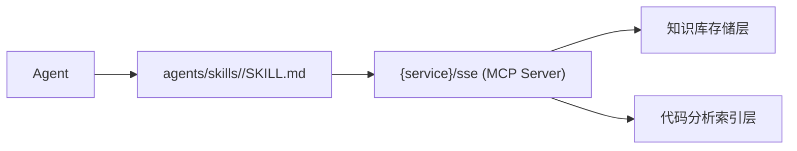

# 知识库与 AI Workflow Control Kit 的集成模式

## 总览

本文件描述将知识库方法论适配到 Kit 的几种集成模式。每种模式对应不同的成熟度和资源投入。

三种集成模式：

| 模式 | 复杂度 | 适用阶段 |
|------|--------|---------|
| [模式 A：文件引用](#模式-a文件引用) | 最低 | 冷启动。Knowledge 以 `.md` 文件形式放入 skill 的 references/ |
| [模式 B：MCP 服务](#模式-bmcp-服务) | 中 | 成熟。Knowledge 通过 MCP server 按需检索 |
| [模式 C：纠错反哺流水线](#模式-c纠错反哺流水线) | 中高 | 高阶。自动记录纠正事件并反哺 |

---

## 模式 A：文件引用

**适用**：个人使用、小团队冷启动、产品化 Stage 1/2

**做法**：将蒸馏产出的知识按四类分类放入 skill 目录

```
agents/skills/<domain>/
  SKILL.md
  references/
    context.md                 # 知识类：业务上下文与设计意图
    behavioral-rules.md        # 模式类：编码规范
    schemas/                   # 事实类：接口 Schema
    enums.md                   # 事实类：枚举定义
    error-codes.md             # 事实类：错误码
    model-code-conflicts.md    # ⚠️ 冲突清单
```

**在 SKILL.md 中声明加载策略**：

```markdown
# <Skill Name>

## References

- [Context（语义层 - 常驻）](./references/context.md)
- [Rules（模式层 - 常驻）](./references/behavioral-rules.md)
- [Schema（明细层 - 按需）](./references/schemas/)
- [Enums（明细层 - 按需）](./references/enums.md)
> 按需项在 SKILL.md body 中引用时自动加载
```

**优点**：零额外基础设施，Git 版本化，支持 PR review

**局限**：知识膨胀时 SKILL.md 的上下文也会膨胀；纠错反哺需手动更新

---

## 模式 B：MCP 服务

**适用**：团队级使用、200+ 知识条目、多服务需求

**做法**：通过 MCP server 暴露知识检索接口



**典型 MCP 资源**：

| resource URI | 返回 | 可信度 |
|------------|------|--------|
| `knowledge://domain/<name>` | 业务领域语义模型（语义层） | 确定 |
| `knowledge://api/<usecase>` | 用例级 API 说明（能力层） | 确定 |
| `knowledge://schema/<table>` | 表结构定义（明细层） | 确定 |
| `knowledge://conflicts` | 所有已知冲突清单 | 冲突 |
| `knowledge://search?q=<query>` | 全文检索结果 | 混合 |

**在 SKILL.md 中声明 MCP 依赖**：

```markdown
## Dependencies

- MCP Server: `contract-mcp` (SSE endpoint: http://localhost:9080/sse)

## Context

<!-- 语义层常驻：使用 MCP resource 加载 -->
读 `knowledge://domain/contract` 获取合同领域语义模型
```

**优点**：
- 知识集中存储，跨 skill 复用
- 支持实时更新
- 可按需加载，不膨胀 skill 上下文

**局限**：需要维护 MCP server；首次搭建成本高

---

## 模式 C：纠错反哺流水线

**适用**：有成熟技能运行数据的团队，追求知识库持续进化

**做法**：将反哺循环自动化

```
replay-autopilot 执行 skill
    │  执行失败 / 人工纠正
    ▼
记录纠正事件 → 结构化为反哺条目
    │
    ├──→ corrections.log (本地文件)
    │
    ├──→ 自动更新 references/ 中的规则文件
    │    人审批后合入（通过 Git PR）
    │
    └──→ 更新 replay oracle
         下次回放验证至此不再犯同类错
```

**在 Kit 中的组件映射**：

| 步骤 | Kit 组件 |
|------|---------|
| 检测执行错误 | `replay-autopilot` 的 oracle 对比 |
| 记录人工纠正 | `agents/skills/resolve-feedback/` |
| 结构化为反哺条目 | 在 `workflow-history/changes/` 中记录 |
| 更新 references/ | 由人审批后提交 PR |
| 更新 replay oracle | `replay-autopilot` 的 contracts/ |

**完整流水线示例**：

```bash
# 1. AI 在合同录入 skill 执行中犯了错（未触发审批流）
# 2. 人工纠正：创建合同后需自动发起审批流
# 3. 记录到 workflow-history
# 4. 自动建议更新 references/rules.md
# 5. 人审批 → 合入 → replay 验证下次不再犯
```

**优点**：
- 知识库真正"活"起来
- 越用越准的飞轮效应

**局限**：
- 需要团队纪律：每次纠正都记录
- 反哺内容需人工审核，避免噪声污染

---

## 选择指南

| 如果你有 | 推荐模式 | 理由 |
|---------|---------|------|
| 1-2 个技能，个人使用 | A | 零额外成本，足够用 |
| 3-5 个技能，小团队 | A + 部分 C | 文件够用，手工反哺 |
| 5+ 技能，团队级 | B + C | MCP 中心化存储，反哺自动化 |
| 复杂业务系统蒸馏 | B（必须） | 蒸馏产出天然需要 MCP 暴露 |

## 扩展阅读

- [knowledge-taxonomy.md](./knowledge-taxonomy.md) — 四类知识分类与可信度
- [three-loops.md](./three-loops.md) — 三循环运营模型
- [../distillation-methodology/process-s0-to-s6.md](../distillation-methodology/process-s0-to-s6.md) — 蒸馏流程（知识库初始构建）
- [../../skills/resolve-feedback/SKILL.md](../../skills/resolve-feedback/SKILL.md) — 反哺 skill
