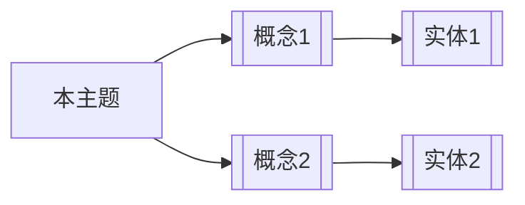

# Page Templates — 各类型 wiki 页面生成模板

## source 摘要页

**位置：** `{area}/wiki/sources/YYYY-MM-DD-kebab-case.md`

```markdown
---
type: source
area: {area}
created: {YYYY-MM-DD}
updated: {YYYY-MM-DD}
source_type: {technical|meeting|requirement|paper|book|travel|article}
source_path: "{area}/raw/sources/{sub-path}"
tags: [{tag1}, {tag2}]
---

# {来源标题}

> 来源：[[{area}/raw/sources/{file}]] | 类型：{source_type} | 收录日期：{date}

## 摘要

{2-3 句话概述}

## 关键要点

1. {要点1}
2. {要点2}
3. {要点3}

## 提取的概念

- [[{area}/wiki/concepts/{concept-1}|{概念名}]]: {一句话}
- [[{area}/wiki/concepts/{concept-2}|{概念名}]]: {一句话}

## 提取的实体

- [[{area}/wiki/entities/{entity-1}|{实体名}]]: {一句话}

## 详细内容

{根据来源类型使用 compile-prompts.md 中的对应格式}
```

## concept 概念页

**位置：** `{area}/wiki/concepts/kebab-case.md`

```markdown
---
type: concept
area: {area}
created: {YYYY-MM-DD}
updated: {YYYY-MM-DD}
aliases: [{别名1}, {别名2}]
sources: [{source-id-1}, {source-id-2}]
confidence: {extracted|inferred|unverified}
tags: [{tag1}, {tag2}]
---

# {概念名}

> 置信度：{confidence 说明}

## 定义

{1-2 句话定义}

## 关键论点

### 来源：[[{source-1}]]
- {该来源对概念的描述/观点}

### 来源：[[{source-2}]]
- {该来源对概念的描述/观点}

## 相关概念

- [[{related-concept-1}]]: {关系说明}
- [[{related-concept-2}]]: {关系说明}

## 相关实体

- [[{entity-1}]]: {关系说明}

## 开放问题

- {尚未解答的问题1}
- {尚未解答的问题2}
```

**更新已有 concept 页面时：**
1. 保留现有内容
2. 在"关键论点"下追加新来源的 section
3. 如果新来源与旧来源有矛盾，标注 `⚠️ 矛盾：{来源A}认为X，{来源B}认为Y`
4. 更新 frontmatter 的 `updated` 和 `sources` 字段
5. 检查是否需要更新"相关概念"和"开放问题"
6. **重新评估 confidence**：若新 source 增加了原文佐证（如从 1 个 source 变成 2 个 source），可升级（unverified → inferred → extracted）；若新 source 引入矛盾，降级为 inferred

## entity 实体页

**位置：** `{area}/wiki/entities/kebab-case.md`

```markdown
---
type: entity
area: {area}
entity_type: {person|team|system|product|organization|place}
created: {YYYY-MM-DD}
updated: {YYYY-MM-DD}
aliases: [{别名1}]
systems: [{system1}]  # 仅 work 领域
sources: [{source-id-1}]
confidence: {extracted|inferred|unverified}
tags: [{tag1}]
---

# {实体名}

> 置信度：{confidence 说明}

## 简介

{1-2 句话描述}

## 关键特点/贡献

- {特点1}
- {特点2}

## 相关概念

- [[{concept-1}]]: {关系}
- [[{concept-2}]]: {关系}

## 相关实体

- [[{entity-2}]]: {关系}

## 来源视角

### [[{source-1}]]
{该来源如何描述此实体}
```

## theme 主题综述页

**位置：** `{area}/wiki/themes/kebab-case.md`

```markdown
---
type: theme
area: {area}
created: {YYYY-MM-DD}
updated: {YYYY-MM-DD}
sources: [{source-1}, {source-2}, {source-3}]
related_concepts: [[{concept-1}], [{concept-2}]]
tags: [{tag1}]
---

# {主题标题}

## 概述

{3-5 句话综合描述，体现跨来源的综合分析}

## 核心概念图谱



## 关键争议

| 观点 | 来源 | 论据 |
|------|------|------|
| {观点A} | [[{source-1}]] | {论据} |
| {观点B} | [[{source-2}]] | {论据} |

## 延伸阅读

- [[{related-theme-1}]]
- [[{related-concept-1}]]
```

## exploration 探索页

**位置：** `{area}/wiki/explorations/kebab-case.md`

```markdown
---
type: exploration
area: {area}
created: {YYYY-MM-DD}
updated: {YYYY-MM-DD}
question: "{原始问题}"
sources: [{source-or-wiki-page-1}, {source-or-wiki-page-2}]
tags: [{tag1}]
---

# {问题标题}

## 问题

{用户的原始问题}

## 回答

{基于 wiki 页面的综合回答}

## 依据

- [[{wiki-page-1}]]: {该页面提供的支持}
- [[{wiki-page-2}]]: {该页面提供的支持}

## 新发现

- {回答过程中发现的新连接或新问题1}
- {新问题2 → 可能需要 ingest 新来源}
```

## stub 页面

当概念/实体涉及其他领域但信息不足时，创建 stub：

```markdown
---
type: concept  # 或 entity
area: {area}
stub: true
created: {YYYY-MM-DD}
updated: {YYYY-MM-DD}
tags: [{tag1}]
---

# {名称}

> 🔗 Stub 页面 — 信息不足，待补充。来源：[[{origin-area}/wiki/{source-page}]]

## 简介

{1 句话}

## 来源引用

- [[{origin-area}/wiki/{source-page}]]: {为什么提到这个概念}
```
