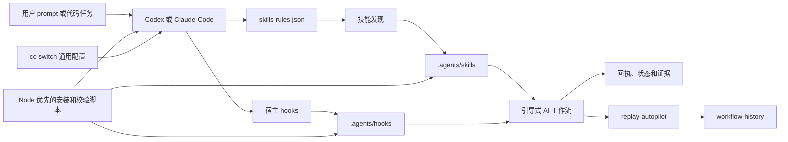
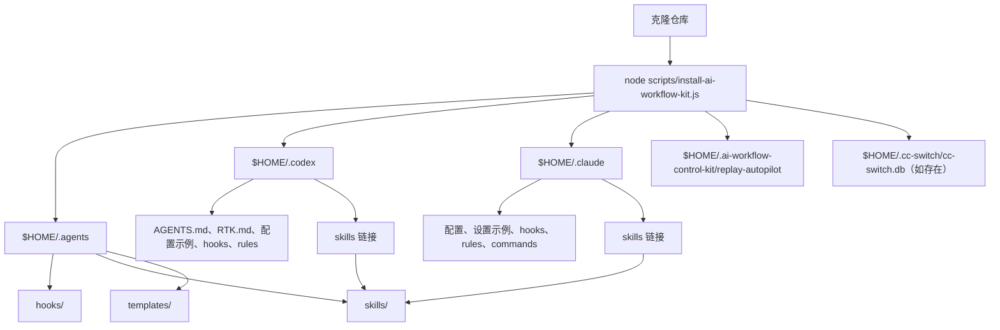
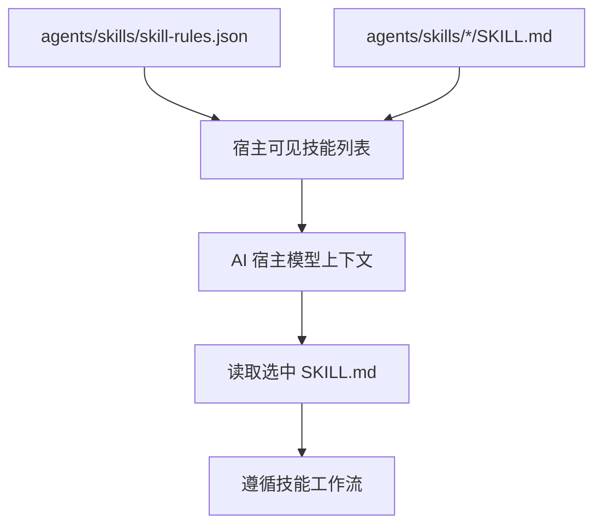
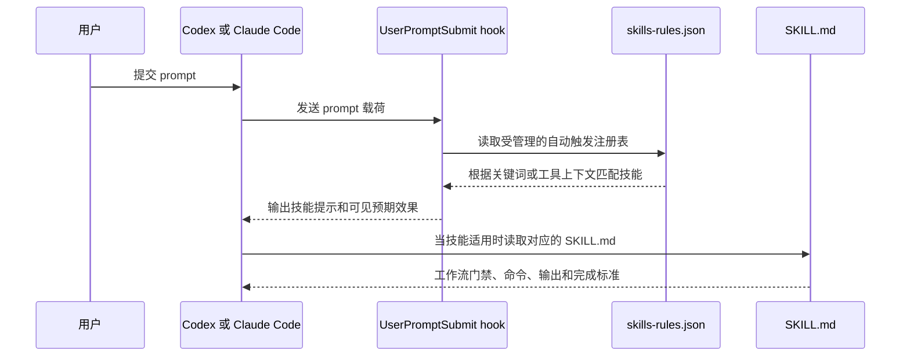
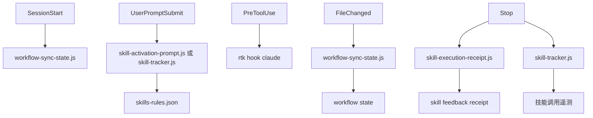
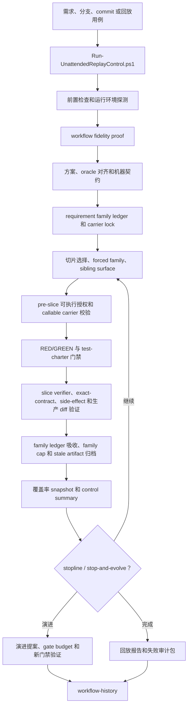
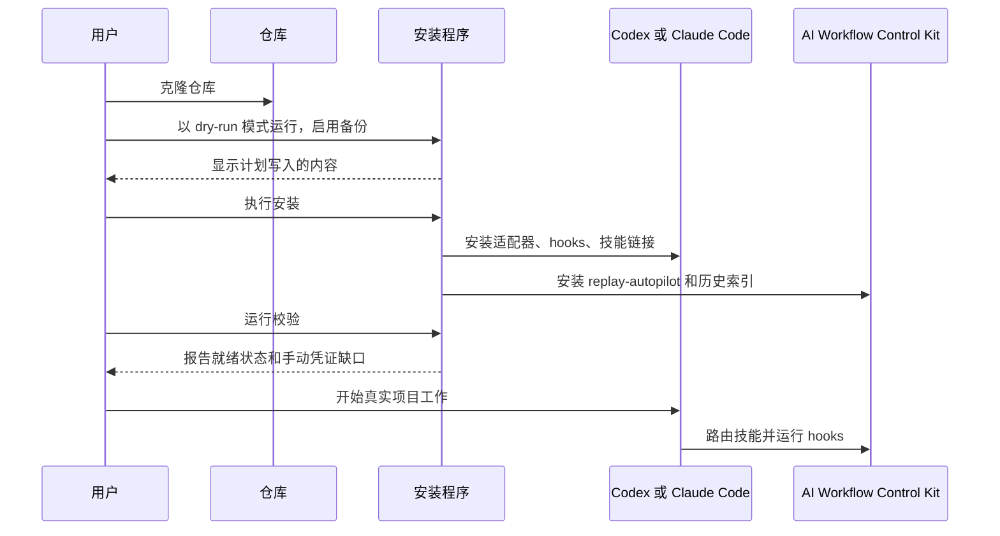

**简体中文** | [English](./ARCHITECTURE.en.md)

# AI Workflow Control Kit 架构

本文档说明 AI Workflow Control Kit 的组装方式、安装内容、技能路由机制、hook 运行方式，以及无人值守回放控制系统的组织结构。

快速概览：

- `agents/` 是自定义技能、hooks、规则和模板的规范源。
- `codex/` 和 `claude/` 是宿主适配器，使同一工作流在 Codex 和 Claude Code 中可用。
- `cc-switch/` 为使用 cc-switch 切换供应商的用户存储可移植的通用配置模板。
- `replay-autopilot/` 是无人值守评估、工作流保真校验、证据门禁、覆盖率核算和工作流演进控制平面。
- `workflow-history/` 是仓库本地的变更日志，用于回放和工作流自动化。
- `scripts/` 包含 Node 优先的安装、校验、cc-switch 更新和密钥扫描脚本。

## 系统概览



AI Workflow Control Kit 不是一个模型或单一 agent。它是一个围绕 AI 编码宿主构建的控制平面。仓库提供本地文件，教会宿主如何路由工作、加载哪些技能、运行哪些生命周期 hooks，以及如何回放工作流进行评估。

## 仓库布局

```text
agents/
  AGENTS.md
  .skill-lock.json
  hooks/
  skills/
  templates/

codex/
  AGENTS.md
  RTK.md
  config.toml.example
  hooks/
  rules/
  skill-rules.json
  skills/

claude/
  config.json
  settings.example.json
  agents/
  commands/
  hooks/
  output-styles/
  rules/
  skills/
  templates/

cc-switch/
  common_config_claude.json.template
  common_config_codex.toml.template

replay-autopilot/
  config.yaml
  contracts/
  features/
  phases/
  prompts/
  scripts/
  templates/
  test/
  tests/
  tools/

workflow-history/
  CHANGELOG.md
  latest.json
  changes/

scripts/
  install-ai-workflow-kit.js
  install-cc-switch-common-config.js
  verify-ai-workflow-kit.js
  test-no-secrets.js
```

`custom-skills-history/` 保存历史技能材料。在比较或恢复之前的技能行为时有用，但当前活跃的技能源是 `agents/skills/`。

## 安装目录模型

安装程序将可移植的源树复制到用户的宿主目录，并将两个宿主技能文件夹链接回同一规范技能目录。



默认安装目标：

| 目标 | 用途 |
| --- | --- |
| `$HOME/.agents` | 宿主共享的规范工作流文件。 |
| `$HOME/.agents/hooks` | Node 优先的 hook 脚本和遗留兼容性脚本。 |
| `$HOME/.agents/skills` | 规范的自定义技能源。 |
| `$HOME/.codex` | Codex 全局适配器文件和 Codex hook 脚本。 |
| `$HOME/.codex/skills` | 指向 `$HOME/.agents/skills` 的链接。 |
| `$HOME/.claude` | Claude Code 适配器文件和示例设置。 |
| `$HOME/.claude/skills` | 指向 `$HOME/.agents/skills` 的链接。 |
| `$HOME/.ai-workflow-control-kit/replay-autopilot` | replay-autopilot 默认安装目标。 |
| `$HOME/.cc-switch/cc-switch.db` | 可选的 cc-switch 数据库，通过通用配置模板更新。 |

安装程序支持 `--dry-run` 和 `--backup-existing`，以便新机器在替换本地宿主文件之前预览写入内容。

## 规范技能模型

`agents/skills/` 包含可重用的工作流能力。每个技能是一个包含 `SKILL.md` 文件的目录。前置元数据提供名称和触发摘要；正文提供操作流程。



技能分组：

| 分组 | 技能 | 用途 |
| --- | --- | --- |
| 入口和上下文 | `workflow-router`、`restore-context`、`pre-flight-check` | 路由模糊请求、恢复上下文、把关写入或验证。 |
| 需求和规划 | `requirement-assessment`、`req-alignment-check`、`ideate`、`deep-plan` | 评估需求、对齐范围、探索选项、创建技术方案。 |
| 实现 | `dev-workflow`、`auto-complete`、`add-comments` | 端到端实现驱动、高自主性执行、补充有意义的注释。 |
| 测试和质量 | `gen-tests`、`quality-check`、`deep-review`、`resolve-feedback` | 添加测试、评分质量、审查变更、处理审查反馈。 |
| 学习和记忆 | `compound-learning`、`dialogue-learning`、`knowledge-refresh`、`sync-progress`、`retro` | 捕获反复出现的教训、刷新知识、同步进度、开展回顾。 |
| 发布和协作 | `ship-release`、`rdc-git` | 发布变更，在手动调用时支持公司特定的 Git/MR 工作流。 |
| 技能治理 | `skill-platform-maintenance`、`skill-audit`、`skill-evolution` | 维护宿主集成、审计技能、演进技能集。 |
| 内容入库 | `article-to-obsidian`、`video-to-obsidian`、`yuque-to-markdown`、`obsidian-wiki` | 将源材料转换为本地知识工件。 |
| 运维和领域工具 | `log-investigator`、`backend-effort-estimate` | 调查日志，在范围足够明确时填写后端工作量评估。 |
| 回放控制 | `replay-pre-flight-check`、`replay-tdd-enforcer`、`replay-test-charter-validator` | 强制回放专属的环境、TDD 和 test-charter 门禁。 |

`rdc-git` 被明确标记为不归通用自动触发注册表管理，因其是公司特定的。在环境和团队约定匹配时仍可手动使用。

## `skills-rules.json` 的路由机制

`agents/skills/skill-rules.json` 是受管理的自动触发注册表。其顶层结构如下：

```json
{
  "_meta": {
    "runtime_truth": "...",
    "intentionally_unmanaged_skills": {}
  },
  "skills": {
    "skill-name": {
      "description": "...",
      "priority": "critical",
      "scope_tier": "host-workflow",
      "scope_note": "...",
      "auto_apply": true,
      "feedback_summary": "...",
      "triggers": {
        "keywords": ["..."],
        "tools": ["Edit", "Write"]
      }
    }
  }
}
```

路由流程：



重要行为说明：

- 关键词触发只是提示，不是盲目的自动化。宿主仍然会读取相关的 `SKILL.md` 并将工作流应用于当前请求。
- `priority` 帮助宿主将某些技能视为门禁，如写入前的 `pre-flight-check`。
- `scope_tier` 区分通用技能和依赖本套件本地记忆、hooks 或回放约定的宿主工作流技能。
- `auto_apply` 标记在触发条件明确时无需显式斜杠命令即可建议的技能。
- `feedback_summary` 由 hooks 使用，向用户展示匹配技能应有的效果。
- `triggers.tools` 可以识别某些工具类别（如文件编辑）是否应触发前置门禁。

同一规则文件被复制到宿主适配器位置，以便 Codex 和 Claude Code 看到一致的路由契约：

```text
agents/skills/skill-rules.json
codex/skill-rules.json
claude/skills/skill-rules.json -> 通过安装的技能链接
```

## Hook 架构

Hooks 将工作流逻辑附加到宿主生命周期事件。默认的高频路径是 Node 优先的。



Hook 职责：

| 事件 | 默认命令 | 用途 |
| --- | --- | --- |
| `SessionStart` | `node .../workflow-sync-state.js` | 在启动或恢复时恢复或刷新每项目的工作流状态。 |
| `UserPromptSubmit` | `node .../skill-activation-prompt.js` 或 `node .../skill-tracker.js codex_user_prompt_submit` | 将 prompt 文本与技能规则匹配，输出简洁的技能提示。 |
| `PreToolUse` | `rtk hook claude` | 在 Bash 风格工具执行前，将 Claude shell 使用路由到 RTK。 |
| `FileChanged` | `node .../workflow-sync-state.js` | 按分类跟踪最近编辑，以便后续回执能解释变更内容。 |
| `Stop` | `node .../skill-execution-receipt.js` 和/或 `node .../skill-tracker.js codex_stop` | 总结技能效果、捕获回执、报告会话停止事件。 |

Node 优先脚本：

| 脚本 | 角色 |
| --- | --- |
| `agents/hooks/skill-activation-prompt.js` | 读取 prompt 载荷和 `skill-rules.json`，输出匹配的技能提示。 |
| `agents/hooks/workflow-sync-state.js` | 跟踪项目编辑和工作流状态，不阻塞宿主。 |
| `agents/hooks/skill-execution-receipt.js` | 生成回合结束的技能回执，检查预期工件是否已更新。 |
| `codex/hooks/scripts/skill-tracker.js` | 跟踪 Codex 技能提及和停止事件，用于遥测风格的回执。 |

遗留的 PowerShell 文件仍然存在以保持兼容性和回放工具链，但 Windows PowerShell 5.1 不应放置在高频 prompt hooks 中。Node 优先的安装和校验程序对实时的 Claude/Codex hook 路径强制执行这一期望。

## 宿主适配器

### Codex

Codex 适配器文件：

| 文件 | 用途 |
| --- | --- |
| `codex/AGENTS.md` | 全局 Codex 指令，指向 RTK 和工作流约定。 |
| `codex/RTK.md` | Token 感知的 shell 使用指引。 |
| `codex/config.toml.example` | 示例 hook 和全局配置块。 |
| `codex/hooks/scripts/skill-tracker.js` | Codex hook 端的技能追踪器。 |
| `codex/skill-rules.json` | 宿主适配器副本的管理路由规则。 |
| `codex/rules/` | 额外的 Codex 规则文件。 |

Codex 应在 `config.toml` 中使用 hook 定义。不要同时保留 `hooks.json` 和 `config.toml` 中的 hook 定义，因为混合 hook 源可能造成重复源警告和不可预测的维护行为。

### Claude Code

Claude 适配器文件：

| 文件或目录 | 用途 |
| --- | --- |
| `claude/settings.example.json` | 示例设置，包含 Node 优先的 hooks 和 RTK 集成。 |
| `claude/config.json` | 可移植基础配置占位符。 |
| `claude/agents/` | Claude agent 定义。 |
| `claude/commands/` | Claude 命令适配器。 |
| `claude/hooks/` | 遗留兼容性 hooks 和辅助脚本。 |
| `claude/rules/` | Claude 规则文件。 |
| `claude/output-styles/` | Claude 输出风格定义。 |

已安装的实时 Claude 设置应使用：

```text
node "$HOME/.agents/hooks/skill-activation-prompt.js"
node "$HOME/.agents/hooks/skill-execution-receipt.js"
node "$HOME/.agents/hooks/workflow-sync-state.js"
rtk hook claude
```

## cc-switch 集成

`cc-switch/` 包含供应商中立的通用配置模板：

| 模板 | 目标 |
| --- | --- |
| `common_config_codex.toml.template` | cc-switch `common_config_codex` 设置。 |
| `common_config_claude.json.template` | cc-switch `common_config_claude` 设置。 |

Node 更新器在数据库存在时将这些模板写入 `$HOME/.cc-switch/cc-switch.db`：

```bash
node scripts/install-cc-switch-common-config.js
```

模板使用占位符如：

```text
<USERPROFILE>
<USERPROFILE_SLASH>
<AGENTS_HOME_SLASH>
<CODEX_HOME_SLASH>
<CLAUDE_HOME_SLASH>
<REPLAY_AUTOPILOT_ROOT_SLASH>
```

不得包含：

- 真实的 API 密钥
- 真实的供应商 token
- 本地认证 JSON
- SQLite 运行时状态
- 特定机器的私有项目列表（除非用户明确选择信任某个本地项目）

项目信任被有意控制在最低限度。用户应在实际使用项目时才添加信任项目，而不是作为通用安装的一部分。

## Node 优先工具

默认操作脚本是 Node 优先的：

| 脚本 | 用途 |
| --- | --- |
| `scripts/install-ai-workflow-kit.js` | 安装适配器、技能、hooks、cc-switch 通用配置和 replay-autopilot。 |
| `scripts/install-cc-switch-common-config.js` | 从模板更新 cc-switch 通用配置。 |
| `scripts/verify-ai-workflow-kit.js` | 验证实时的宿主配置、链接、hooks 和 replay 控制器存在性。 |
| `scripts/verify-control-contracts.js` | 验证仓库内 GoalSpec 和 skill lock 等控制契约，默认兼容历史 lock，严格模式可要求 hash 完整性。 |
| `scripts/diagnose-powershell-r6016.js` | 将正在运行的 `powershell.exe` 进程分类为 Codex AST 解析器、RTK 包装器、构建命令或未知来源。 |
| `scripts/test-no-secrets.js` | 在提交或推送前扫描仓库中的凭证和运行时状态。 |

当这些脚本需要另一个可执行文件时，它们直接通过 `execFile` 调用，而不是通过 shell 解释器。这是有意为之：基于 shell 的高频路径在 Windows 上很脆弱，之前当 Windows PowerShell 5.1 在 prompt hooks 中使用时曾导致 `R6016 - not enough space for thread data` 故障。

`codex/RTK.md` 有意说明要选择性地使用 RTK。不要将 Windows 命令包装为 `rtk proxy powershell ...`；对构建和测试命令使用直接可执行文件，如 `git.exe`、`node.exe`、`python.exe` 或 `mvn.cmd`。

## 无人值守回放控制平面

`replay-autopilot/` 是一个控制系统，用于评估工作流是否能通过可重复的门禁驱动 AI 编码任务。它现在的核心不是信任一次模型回答，而是把每个阶段的授权、执行、验证、覆盖率和演进原因写成结构化证据，再由后续门禁读取这些证据做调度和收口。

当前基线把 replay-autopilot 本身作为默认改进目标：`replay-autopilot-goal.md` 描述 90% real coverage 目标，`replay-autopilot/config.yaml` 指向该目标和默认 replay evidence 根目录。这样无人值守控制循环不会再把 `README.md` 或示例 feature 当作真实需求来源。

该目录包含通用的控制平面脚本，以及来自基准测试的配置、需求和 fixture，用作回归测试用例。将这些基准测试文件视为控制平面的评估输入。它们不是已安装的凭证、运行时日志、私有的 oracle diff 或业务源代码，新项目应添加自己的本地配置，而不是将附带的基准测试用例当作默认项目。



主要回放组件：

| 组件 | 目录或脚本 | 角色 |
| --- | --- | --- |
| 控制器 | `scripts/Run-UnattendedReplayControl.ps1`、`scripts/Start-UnattendedReplayControl.ps1` | 编排无人值守周期和停止条件。 |
| 前置检查 | `scripts/Invoke-PreflightComprehensive.ps1`、`scripts/pre_flight_check.py` | 验证环境、项目状态和测试就绪性。 |
| 工作流保真 | `scripts/Write-WorkflowFidelityProof.ps1`、`scripts/Invoke-PreSliceToolAvailabilityGate.ps1`、`scripts/Invoke-AgentPrompt.ps1` | 在 agent 执行前记录 executor、hook 状态、技能根、运行时技能可见性和 `SKILL.md` hash；关键技能不可见时阻断执行。 |
| 方案规划 | `prompts/`、`scripts/generate_plan.ps1`、`scripts/Verify-PlanContract.ps1` | 将回放目标转换为有边界的方案、oracle 对齐证据和机器可检查的契约；允许真实的 `replay-autopilot/scripts/*.ps1` 控制面脚本作为 production carrier，同时拒绝 `scripts/tests` 路径。 |
| 切片控制 | `scripts/Select-NextReplaySlice.ps1`、`scripts/Run-SliceLoop.ps1` | 选择下一个实现切片，处理 resume/reuse，归档 stale slice artifact，并维护 slice progress。 |
| 可执行授权 | `scripts/Prepare-SliceEvidenceContracts.ps1`、`scripts/Invoke-PreSliceExperimentContracts.ps1`、`scripts/Invoke-CallableCarrierAuthorization.ps1` | 在进入 agent 执行前绑定真实入口、forced family、sibling surface、测试选择器和 callable carrier。 |
| TDD 门禁 | `replay-tdd-enforcer` 技能、`scripts/enforce_red_phase_gate.py` | 要求有意义的 RED 和 GREEN 阶段。 |
| Test-charter 门禁 | `replay-test-charter-validator` 技能、`scripts/Invoke-TestCharterPrevalidator.ps1` | 要求测试证明副作用，而不仅仅是辅助行为。 |
| 载波和 oracle 检查 | `scripts/*Carrier*`、`scripts/*Oracle*` | 将实现绑定到真实入口点、真实方法签名和可信 oracle 证据。 |
| Slice verifier | `scripts/Verify-SliceClosure.ps1`、`scripts/verify-slice.ps1` | 根据 slice result、测试命令、生产 diff、exact-contract、side-effect 和 blocker/gap flags 判断是否可继续、可综合或必须 fail closed。 |
| Requirement family ledger | `scripts/Run-SliceLoop.ps1`、`scripts/verify_family_proof_ledger.ps1`、`scripts/verify-family-ledger-from-slice-verify.ps1` | 记录 requirement family 的 open/partial/closed 状态、proof 类型、cap 和可继续的下一切片目标。 |
| 覆盖率核算 | `scripts/Get-RoundCoverageSnapshot.ps1`、`scripts/Enforce-RoundCoverageCap.ps1`、`scripts/recompute_round_coverage.py`、control summary 相关脚本 | 从结构化 slice/verifier/ledger 证据恢复真实覆盖率，限制自评膨胀，并在早停时保留已验证进展。 |
| Stopline 和控制摘要 | `scripts/Invoke-ReplayStoplineGate.ps1`、`scripts/Write-ControlPlaneSummary.ps1` | 判断近期 round 是否真正无进展，避免旧 blocker 或旧 markdown 摘要覆盖后续 slice 证据。 |
| 演进 | `scripts/New-EvolutionProposal.ps1`、`scripts/Invoke-V419StopAndEvolveExperiments.ps1`、`scripts/Validate-EvolutionResult.ps1` | 将重复失败模式转化为工作流改进，并用 gate budget、实验 ledger、changed-file 校验、知识版本核对和回归测试证明新增门禁确有必要。 |
| 回归测试 | `scripts/Test-v*.ps1`、`test/`、`tests/` | 跨历史工作流变更验证回放控制行为。 |

关键 artifact 类型：

| Artifact | 作用 |
| --- | --- |
| `WORKFLOW_FIDELITY_PROOF.json`、`*.workflow-fidelity.json` | 记录 executor、hook 配置、技能源和运行时技能可见性；运行时缺少必需技能时阻断 agent 执行。 |
| `PLAN_RESULT.md`、`PLAN_CONTRACT_VERIFY.json` | 记录计划阶段的选择、阻断原因和机器契约验证。 |
| `SLICE_RESULT_NN.json`、`SLICE_VERIFY_NN.json` | 记录每个切片的执行状态、测试证据、gap flags、授权状态、覆盖率增量和关闭的 requirement family。 |
| `REQUIREMENT_FAMILY_LEDGER.json` | 记录 requirement family 状态、open sibling surfaces、proof 类型和 coverage cap。 |
| `CARRIER_LOCK.json`、`RUNNABLE_SLICE_AUTHORIZATION_NN.json`、`PRE_SLICE_AUTHORIZATION_NN.json` | 记录真实 carrier、可执行入口和进入 slice agent 前的授权条件。 |
| `ROUND_RESULT.md`、`AUTOPILOT_SUMMARY.md`、`AUTOPILOT_DECISION.md` | 汇总 round 结果、覆盖率和下一步控制决策；早停时应优先保留结构化证据中的覆盖率。 |
| `VERIFIABLE_RULES.json`、`VERIFIABLE_RULES.md` | 将 failure audit 或 blocked-plan early stop 转换成必须关闭的机器可检查规则。 |
| `EVOLUTION_RESULT.md`、`EVOLUTION_RESULT_VERIFY.json`、stop-and-evolve 实验 ledger | 记录演进是否真正通过验证、新增门禁是否有预算和必要性，以及 changed files 是否对应真实 tooling diff。 |

受保护项目根目录默认 fail closed。只有 `evolution` 和 `evolution-repair` 阶段可以在窄 allowlist 内修改 replay tooling、workflow history、技能镜像和知识历史文件；allowlist 区分目录前缀和精确文件路径，例如 `CURRENT_VERSION.md` 是允许的精确根文件，而任意业务项目文件不会被放行。

回放目前仍保留许多 PowerShell 控制器脚本。它们不是默认的高频 prompt hook 路径。当可用时，手动回放验证推荐使用 PowerShell 7（`pwsh`）。Plan contract 校验会把 `replay-autopilot/scripts/*.ps1` 中的真实控制面脚本视作可验证 carrier，但仍拒绝 `replay-autopilot/scripts/tests/*.ps1` 作为生产 carrier。

## 工作流历史

`workflow-history/` 使仓库自包含。它消除了读取个人知识库以了解最新工作流版本的需求。


文件：

| 文件 | 用途 |
| --- | --- |
| `workflow-history/CHANGELOG.md` | 人类可读的主索引。 |
| `workflow-history/latest.json` | 机器可读的指向最新变更的指针。 |
| `workflow-history/changes/*.md` | 具体的变更记录，包含摘要、工件和验证。 |

当可重用的工作流行为发生变化时，三者都需要更新。

`workflow-history/latest.json` 是 replay 控制面发现最新工作流行为的机器入口；`CURRENT_VERSION.md` 记录知识/技能演进版本。二者可能推进节奏不同，文档和控制器应按用途读取，不能用知识版本替代工作流 latest 指针。

## 安全边界

本仓库必须保持可移植和干净。它不应包含：

- 供应商 token
- API 密钥
- 本地认证文件
- 会话记录
- SQLite 数据库
- 运行时日志
- 本地记忆
- 私有业务源代码
- oracle diff 或生产数据

`.memory/` 被有意忽略，因为它是特定用户机器的本地内容，不应作为通用工作流真理推送。

在发布前：

```bash
node scripts/test-no-secrets.js
node scripts/verify-ai-workflow-kit.js
```

## 新用户心智模型

新用户应能够克隆仓库，让 AI 宿主阅读 `README.md` 和本文档，以 dry-run 模式运行安装程序，安装并备份，验证，然后开始使用工作流。

预期的安装流程：



核心承诺不是 AI 永远知道该做什么。承诺是工作流让决策更加明确、把关有风险的工作、记录证据，并提供一条可回放的路径来改进工作流本身。
