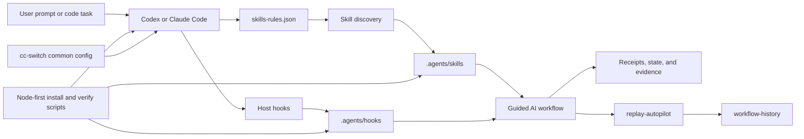
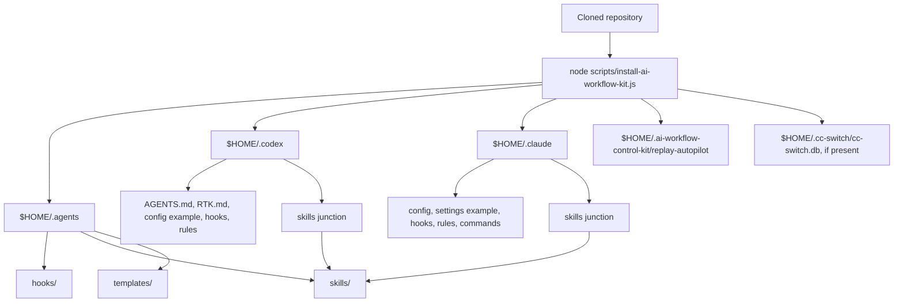
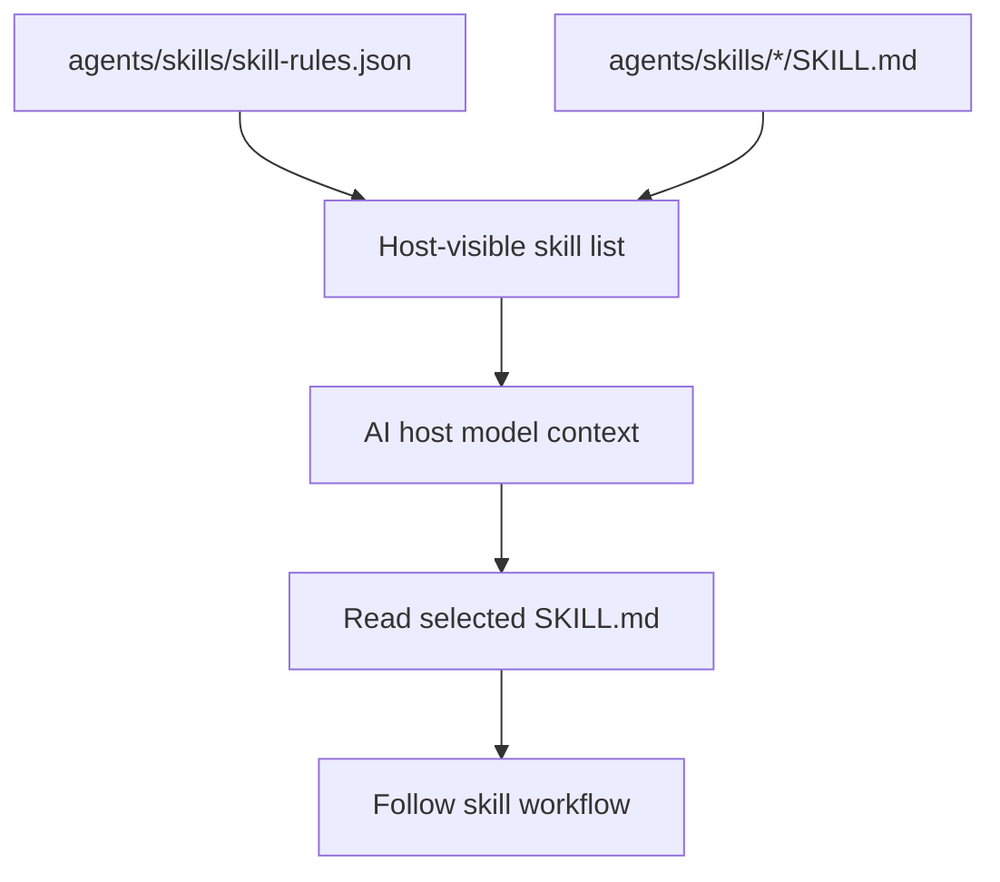
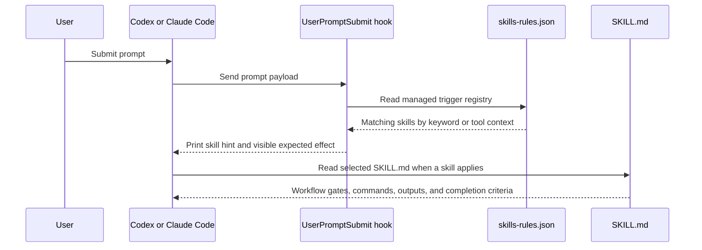
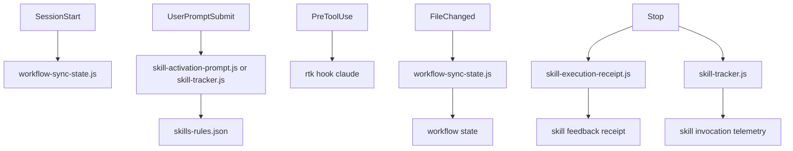
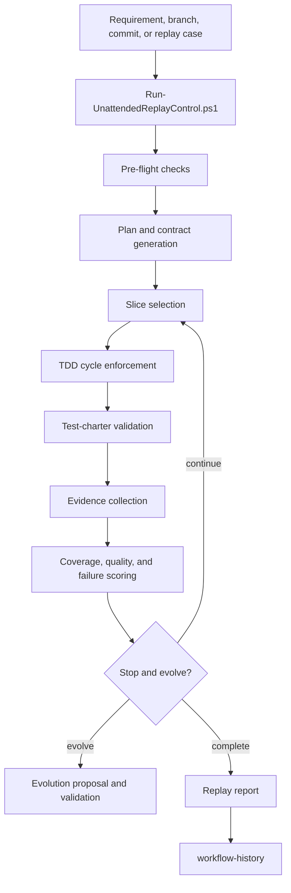
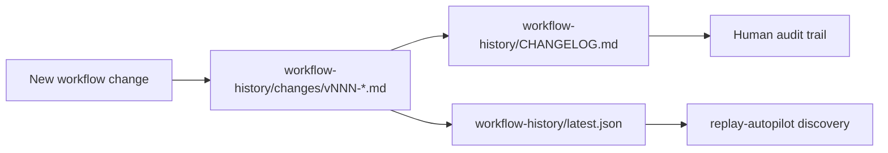
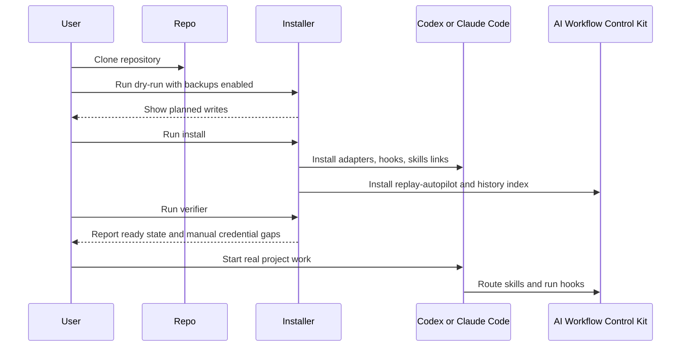

# AI Workflow Control Kit Architecture

This document explains how AI Workflow Control Kit is assembled, what it installs, how skills are routed, how hooks run, and how the unattended replay control system is organized.

The short version:

- `agents/` is the canonical source for custom skills, hooks, rules, and templates.
- `codex/` and `claude/` are host adapters that make the same workflow available in Codex and Claude Code.
- `cc-switch/` stores portable common config templates for people who switch providers through cc-switch.
- `replay-autopilot/` is the unattended evaluation and control plane.
- `workflow-history/` is the repository-local changelog used by replay and workflow automation.
- `scripts/` contains the Node-first installer, verifier, cc-switch updater, and secret scanner.

## System Overview



AI Workflow Control Kit is not a model or a single agent. It is a control plane around AI coding hosts. The repository provides the local files that teach a host how to route work, which skills to load, which lifecycle hooks to run, and how to replay a workflow for evaluation.

## Repository Layout

```text
agents/
  AGENTS.md
  .skill-lock.json
  hooks/
  skills/
  templates/

codex/
  AGENTS.md
  RTK.md
  config.toml.example
  hooks/
  rules/
  skill-rules.json
  skills/

claude/
  config.json
  settings.example.json
  agents/
  commands/
  hooks/
  output-styles/
  rules/
  skills/
  templates/

cc-switch/
  common_config_claude.json.template
  common_config_codex.toml.template

replay-autopilot/
  config.yaml
  contracts/
  features/
  phases/
  prompts/
  scripts/
  templates/
  test/
  tests/
  tools/

workflow-history/
  CHANGELOG.md
  latest.json
  changes/

scripts/
  install-ai-workflow-kit.js
  install-cc-switch-common-config.js
  verify-ai-workflow-kit.js
  test-no-secrets.js
```

`custom-skills-history/` keeps historical skill material. It is useful when comparing or recovering previous skill behavior, but the active skill source is `agents/skills/`.

## Installed Directory Model

The installer copies the portable source tree into the user's host directories and links both host skill folders back to the same canonical skill directory.



Default install targets:

| Target | Purpose |
| --- | --- |
| `$HOME/.agents` | Canonical workflow files shared by hosts. |
| `$HOME/.agents/hooks` | Node-first hook scripts and legacy compatibility scripts. |
| `$HOME/.agents/skills` | Canonical custom skill source. |
| `$HOME/.codex` | Codex global adapter files and Codex hook scripts. |
| `$HOME/.codex/skills` | Junction or symlink to `$HOME/.agents/skills`. |
| `$HOME/.claude` | Claude Code adapter files and example settings. |
| `$HOME/.claude/skills` | Junction or symlink to `$HOME/.agents/skills`. |
| `$HOME/.ai-workflow-control-kit/replay-autopilot` | Default replay-autopilot install target. |
| `$HOME/.cc-switch/cc-switch.db` | Optional cc-switch database updated with common config templates. |

The installer supports `--dry-run` and `--backup-existing` so a new machine can preview writes before any local host files are replaced.

## Canonical Skill Model

`agents/skills/` contains the reusable workflow capabilities. Each skill is a directory with a `SKILL.md` file. The front matter provides the name and trigger summary; the body provides the operating procedure.



Skill groups:

| Group | Skills | Purpose |
| --- | --- | --- |
| Entry and context | `workflow-router`, `restore-context`, `pre-flight-check` | Route vague requests, restore context, and gate writes or verification. |
| Requirements and planning | `requirement-assessment`, `req-alignment-check`, `ideate`, `deep-plan` | Evaluate requirements, align scope, explore options, and create technical plans. |
| Implementation | `dev-workflow`, `auto-complete`, `add-comments` | Drive end-to-end implementation, high-autonomy execution, and useful code comments. |
| Testing and quality | `gen-tests`, `quality-check`, `deep-review`, `resolve-feedback` | Add tests, score quality, review changes, and handle review feedback. |
| Learning and memory | `compound-learning`, `dialogue-learning`, `knowledge-refresh`, `sync-progress`, `retro` | Capture repeated lessons, refresh knowledge, sync progress, and run retrospectives. |
| Release and collaboration | `ship-release`, `rdc-git` | Ship changes and support company-specific Git/MR workflow when manually invoked. |
| Skill governance | `skill-platform-maintenance`, `skill-audit`, `skill-evolution` | Maintain host integrations, audit skills, and evolve the skill set. |
| Content ingestion | `article-to-obsidian`, `video-to-obsidian`, `yuque-to-markdown`, `obsidian-wiki` | Convert source material into local knowledge artifacts. |
| Operations and domain tools | `log-investigator`, `backend-effort-estimate` | Investigate logs and fill backend effort estimates when enough scope is known. |
| Replay control | `replay-pre-flight-check`, `replay-tdd-enforcer`, `replay-test-charter-validator` | Enforce replay-specific environment, TDD, and test-charter gates. |

`rdc-git` is intentionally marked as unmanaged by the generic auto-trigger registry because it is company-specific. It can still be used manually when the environment and team conventions match.

## How `skills-rules.json` Routes Work

`agents/skills/skill-rules.json` is the managed auto-trigger registry. Its top-level structure is:

```json
{
  "_meta": {
    "runtime_truth": "...",
    "intentionally_unmanaged_skills": {}
  },
  "skills": {
    "skill-name": {
      "description": "...",
      "priority": "critical",
      "scope_tier": "host-workflow",
      "scope_note": "...",
      "auto_apply": true,
      "feedback_summary": "...",
      "triggers": {
        "keywords": ["..."],
        "tools": ["Edit", "Write"]
      }
    }
  }
}
```

Routing flow:



Important behavior:

- Keyword triggers are hints, not blind automation. The host still reads the relevant `SKILL.md` and applies the workflow to the current request.
- `priority` helps the host treat some skills as gates, such as `pre-flight-check` before writes.
- `scope_tier` distinguishes generic skills from host-workflow skills that depend on this kit's local memory, hooks, or replay conventions.
- `auto_apply` marks skills that can be suggested without an explicit slash command when the trigger is clear.
- `feedback_summary` is used by hooks to show the user what effect a matched skill should have.
- `triggers.tools` can identify cases where a tool class, such as file editing, should imply a pre-flight gate.

The same rules file is copied to host adapter locations so Codex and Claude Code see a consistent routing contract:

```text
agents/skills/skill-rules.json
codex/skill-rules.json
claude/skills/skill-rules.json -> via installed skills link
```

## Hook Architecture

Hooks attach workflow logic to host lifecycle events. The default high-frequency path is Node-first.



Hook responsibilities:

| Event | Default command | Purpose |
| --- | --- | --- |
| `SessionStart` | `node .../workflow-sync-state.js` | Restore or refresh per-project workflow state at startup or resume. |
| `UserPromptSubmit` | `node .../skill-activation-prompt.js` or `node .../skill-tracker.js codex_user_prompt_submit` | Match prompt text against skill rules and emit concise skill hints. |
| `PreToolUse` | `rtk hook claude` | Route Claude shell usage through RTK before Bash-style tool execution. |
| `FileChanged` | `node .../workflow-sync-state.js` | Track recent edits by category so later receipts can explain what changed. |
| `Stop` | `node .../skill-execution-receipt.js` and/or `node .../skill-tracker.js codex_stop` | Summarize skill effects, capture receipts, and report session stop events. |

Node-first scripts:

| Script | Role |
| --- | --- |
| `agents/hooks/skill-activation-prompt.js` | Reads the prompt payload and `skill-rules.json`, then prints matched skill hints. |
| `agents/hooks/workflow-sync-state.js` | Tracks project edits and workflow state without blocking the host. |
| `agents/hooks/skill-execution-receipt.js` | Produces end-of-turn skill receipts and checks whether expected artifacts were updated. |
| `codex/hooks/scripts/skill-tracker.js` | Tracks Codex skill mentions and stop events for telemetry-style receipts. |

Legacy PowerShell files still exist for compatibility and replay tooling, but Windows PowerShell 5.1 should not be placed in high-frequency prompt hooks. The Node-first installer and verifier enforce this expectation for live Claude/Codex hook paths.

## Host Adapters

### Codex

Codex adapter files:

| File | Purpose |
| --- | --- |
| `codex/AGENTS.md` | Global Codex instructions that point to RTK and workflow conventions. |
| `codex/RTK.md` | Token-aware shell guidance. |
| `codex/config.toml.example` | Example hook and global config block. |
| `codex/hooks/scripts/skill-tracker.js` | Codex hook-side skill tracker. |
| `codex/skill-rules.json` | Host adapter copy of the managed routing rules. |
| `codex/rules/` | Additional Codex rule files. |

Codex should use hook definitions in `config.toml`. Do not keep both active `hooks.json` and hook definitions in `config.toml`, because mixed hook sources can create duplicate-source warnings and unpredictable maintenance behavior.

### Claude Code

Claude adapter files:

| File or directory | Purpose |
| --- | --- |
| `claude/settings.example.json` | Example settings with Node-first hooks and RTK integration. |
| `claude/config.json` | Portable base config placeholder. |
| `claude/agents/` | Claude agent definitions. |
| `claude/commands/` | Claude command adapters. |
| `claude/hooks/` | Legacy compatibility hooks and helper scripts. |
| `claude/rules/` | Claude rule files. |
| `claude/output-styles/` | Claude output style definitions. |

The installed live Claude settings should use:

```text
node "$HOME/.agents/hooks/skill-activation-prompt.js"
node "$HOME/.agents/hooks/skill-execution-receipt.js"
node "$HOME/.agents/hooks/workflow-sync-state.js"
rtk hook claude
```

## cc-switch Integration

`cc-switch/` contains provider-neutral common config templates:

| Template | Target |
| --- | --- |
| `common_config_codex.toml.template` | cc-switch `common_config_codex` setting. |
| `common_config_claude.json.template` | cc-switch `common_config_claude` setting. |

The Node updater writes these templates into `$HOME/.cc-switch/cc-switch.db` when the database exists:

```bash
node scripts/install-cc-switch-common-config.js
```

The templates use placeholders such as:

```text
<USERPROFILE>
<USERPROFILE_SLASH>
<AGENTS_HOME_SLASH>
<CODEX_HOME_SLASH>
<CLAUDE_HOME_SLASH>
<REPLAY_AUTOPILOT_ROOT_SLASH>
```

They must not contain:

- real API keys
- real provider tokens
- local auth JSON
- SQLite runtime state
- machine-specific private project lists, unless the user explicitly chooses to trust a local project

Project trust is intentionally minimal. Users should add trusted projects when they actually use a project, not as part of a generic installation.

## Node-First Tooling

The default operational scripts are Node-first:

| Script | Purpose |
| --- | --- |
| `scripts/install-ai-workflow-kit.js` | Install adapters, skills, hooks, cc-switch common config, and replay-autopilot. |
| `scripts/install-cc-switch-common-config.js` | Update cc-switch common config from templates. |
| `scripts/verify-ai-workflow-kit.js` | Verify live host config, links, hooks, and replay controller presence. |
| `scripts/diagnose-powershell-r6016.js` | Classify live `powershell.exe` processes as Codex AST parser, RTK wrapper, build command, or unknown source. |
| `scripts/test-no-secrets.js` | Scan the repository for credentials and runtime state before commit or publish. |

When these scripts need another executable, they call it directly with `execFile` instead of invoking a shell interpreter. This is deliberate: shell-backed high-frequency paths are fragile on Windows and previously caused `R6016 - not enough space for thread data` failures when Windows PowerShell 5.1 was used in prompt hooks.

`codex/RTK.md` intentionally says to use RTK selectively. Do not wrap Windows commands as `rtk proxy powershell ...`; use direct executables such as `git.exe`, `node.exe`, `python.exe`, or `mvn.cmd` for build and test commands.

## Unattended Replay Control Plane

`replay-autopilot/` is a control system for evaluating whether the workflow can drive AI coding tasks through repeatable gates.



Major replay components:

| Component | Directory or scripts | Role |
| --- | --- | --- |
| Controller | `scripts/Run-UnattendedReplayControl.ps1`, `scripts/Start-UnattendedReplayControl.ps1` | Orchestrate unattended cycles and stop conditions. |
| Pre-flight | `scripts/Invoke-PreflightComprehensive.ps1`, `scripts/pre_flight_check.py` | Validate environment, project state, and test readiness. |
| Planning | `prompts/`, `scripts/generate_plan.ps1`, `scripts/plan_contract_verify.py` | Convert a replay target into a bounded plan and machine-checkable contract. |
| Slice control | `scripts/Select-NextReplaySlice.ps1`, `scripts/Run-SliceLoop.ps1` | Choose the next implementation slice and run it. |
| TDD gates | `replay-tdd-enforcer` skill, `scripts/enforce_red_phase_gate.py` | Require meaningful RED and GREEN phases. |
| Test-charter gates | `replay-test-charter-validator` skill, `scripts/Invoke-TestCharterPrevalidator.ps1` | Require tests to prove side effects, not just helper behavior. |
| Carrier and oracle checks | `scripts/*Carrier*`, `scripts/*Oracle*` | Bind implementation to real entry points and source-of-truth evidence. |
| Evaluation | `scripts/evaluate_slice_result.py`, `scripts/calculate-coverage-penalty.py` | Score results and cap overclaiming. |
| Evolution | `scripts/New-EvolutionProposal.ps1`, `scripts/Invoke-V419StopAndEvolveExperiments.ps1` | Turn repeated failure patterns into workflow improvements. |
| Regression tests | `scripts/Test-v*.ps1`, `test/`, `tests/` | Validate replay-control behavior across historical workflow changes. |

Replay currently retains many PowerShell controller scripts. They are not the default high-frequency prompt hook path. Prefer PowerShell 7 (`pwsh`) for manual replay validation when available.

## Workflow History

`workflow-history/` makes the repository self-contained. It replaces the need to read a personal knowledge vault just to know the latest workflow version.



Files:

| File | Purpose |
| --- | --- |
| `workflow-history/CHANGELOG.md` | Human-readable master index. |
| `workflow-history/latest.json` | Machine-readable pointer to the newest change. |
| `workflow-history/changes/*.md` | Concrete change records with summary, artifacts, and verification. |

When reusable workflow behavior changes, update all three.

## Security Boundaries

This repository must stay portable and clean. It should never contain:

- provider tokens
- API keys
- local auth files
- session transcripts
- SQLite databases
- runtime logs
- local memories
- private business source code
- oracle diffs or production data

`.memory/` is intentionally ignored because it is local to one user's machine and should not be pushed as general workflow truth.

Before publishing:

```bash
node scripts/test-no-secrets.js
node scripts/verify-ai-workflow-kit.js
```

## New User Mental Model

A new user should be able to clone the repository, ask an AI host to read `README.md` and this document, run the installer in dry-run mode, install with backups, verify, and then begin using the workflow.

The expected installation story is:



The core promise is not that the AI always knows what to do. The promise is that the workflow makes decisions more explicit, gates risky work, records evidence, and provides a replayable path for improving the workflow itself.
